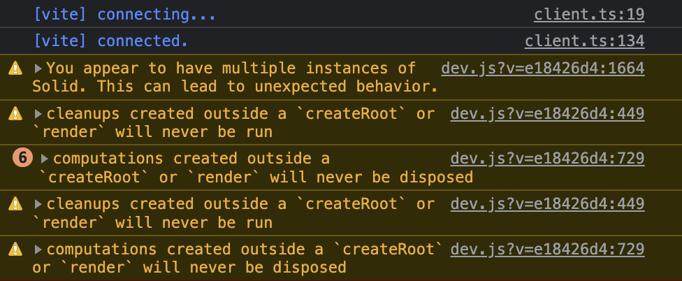

# Repro - Multiple solid instances, `@solidjs/router` + `vite@4.0.1`

In development mode (`vite dev`), routing does not work and the following warnings are observed in console:

Works fine in production builds, and in development + production when using `vite@4.0.0`
